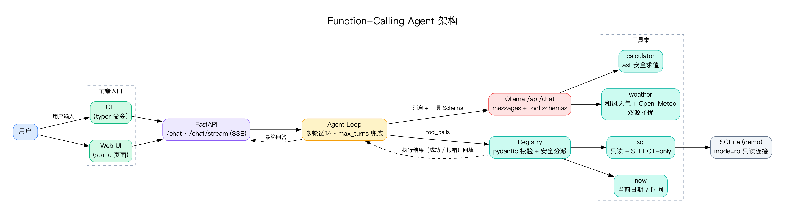

# 02 - Function-Calling Agent

基于 Ollama 原生函数调用（`/api/chat` + `tools`）构建的 Agent，自研工具注册表、结构化输出校验与多轮工具调用循环，不依赖 LangChain 等 Agent 框架。

## 概述

Function-Calling Agent 给 LLM 提供一组带类型的工具定义：模型**决定**调用哪个工具并以结构化参数发出请求；应用层负责校验、执行，把结果回填进对话；模型基于新信息继续推理，直到给出最终答案。

本项目覆盖三个核心考察点：

- **结构化输出** —— 工具参数用 pydantic 模型声明，喂给模型的 JSON Schema 由它生成，调用时再校验一次；参数非法时把机器可读错误回传给模型，让它自我修正。
- **工具注册** —— 声明式 `@tool` 注册表，将（名称、描述、参数 Schema、执行函数）聚合成 Ollama 兼容的 tool 定义并安全分派调用。
- **多轮工具调用** —— `模型 → tool_calls → 执行 → 回填 → 模型 → …` 的循环，直到不再产生 tool_calls；支持并行调用、错误自愈与 `max_turns` 硬上限防死循环。

## 架构



> 源文件：`docs/architecture.dot`（Graphviz），改架构后 `dot -Tpng -Gdpi=150 docs/architecture.dot -o docs/architecture-dot.png` 重新出图。

内置四个工具：

| 工具 | 用途 | 设计要点 |
|------|------|----------|
| `calculator` | 算术计算（基于 `ast` 的安全求值） | 确定性；绝不 `eval` 原始字符串 |
| `weather` | 城市实时天气查询 | Open-Meteo 在线数据（免 key）：先地理编码城市，再取实时温度/天气/湿度/风速 |
| `sql` | 查询 SQLite demo 库 | 只读连接 + 仅允许 SELECT 的护栏 |
| `now` | 当前日期 / 时间 / 星期 | 让模型基于真实时间作答，不靠幻觉 |

## 目录结构

```
02-Function-Calling-Agent/
├── pyproject.toml        # 依赖 + ruff + pytest 配置
├── .env                  # 模型 / 循环 / 数据库 / API 配置
├── agent.py              # CLI 入口（typer）
├── run_server.py         # 启动 FastAPI 服务
├── docs/PRD.md           # 产品需求文档
├── scripts/seed_db.py    # 构建 demo SQLite 数据库
├── src/
│   ├── config.py         # pydantic-settings
│   ├── main.py           # typer 命令：chat / repl / tools / seed
│   ├── tools/            # registry.py + calculator/weather/sql/datetime_tool
│   ├── agent/            # schema.py + loop.py + session.py
│   └── api/              # app.py + routes.py + schemas.py（FastAPI + SSE）
├── static/               # 极简聊天 UI，展示工具调用轨迹
└── tests/                # pytest
```

## 快速开始

```bash
python3 -m venv .venv && source .venv/bin/activate
pip install -e ".[dev]"

ollama pull qwen2.5       # 需要 Ollama 0.5.3+

# 先建 demo 库，再与 Agent 对话
python -m scripts.seed_db
python agent.py chat "员工表有多少人？平均薪资是多少？"
python agent.py chat -m qwen3:8b "北京天气？"  # 指定模型
python agent.py repl                           # 交互式会话（/model <名称> 切换模型）
python agent.py tools                          # 列出所有已注册工具及 Schema
```

启动 Web 服务（UI + SSE 流式）：

```bash
python run_server.py
# 打开 http://localhost:8001
```

API 一览：

| 接口 | 方法 | 说明 |
|------|------|------|
| `/api/chat` | POST | 非流式问答；body 支持 `model` 覆盖单次使用的模型 |
| `/api/chat/stream` | POST | SSE 流式；事件 `chunk` / `tool_call` / `tool_result` / `done` |
| `/api/tools` | GET | 列出全部已注册工具 |
| `/api/models` | GET | 列出本机支持工具调用的 Ollama 模型及当前默认模型 |
| `/api/model` | POST | 切换服务端默认模型，body `{"model": "名称"}`，成功后后台预热加载 |
| `/api/sessions/{id}` | GET | 读取某会话的历史消息（页面刷新恢复上下文用）|
| `/api/health` | GET | 服务与模型状态 |

## 关键设计取舍

- **自研循环而非 LangChain / LlamaIndex**：协议每一步都显式可控、可手讲，这正是本课题的目的。
- **原生 `tools` 参数而非 ReAct 自由文本**：模型必须输出合法的结构化调用，原生模式最可靠——这是"结构化输出"考察点的答案。
- **数据库工具采用只读 + 仅 SELECT 的 SQLite**：工具意味着攻击面扩大；DB 工具是安全意识的体现：`mode=ro` 连接、归一化 `SELECT`-only 校验、给模型返回可自愈的机器可读拒绝信息。
- **天气用 mock 而非真实 API**：完全离线、确定性，测试稳定零网络；模块边界清楚，后续可无缝切换 wttr.in 或真实服务商。
- **SSE 的 token 级流式转为单 chunk 降级**：Ollama 0.33.3 + `qwen2.5` 在 `stream: True` 与 `tools` 并存时返回空结果；为保证工具调用正确性，`chat_stream` 内部走非流式调用、把整段回答作为一个 chunk 事件下发，事件协议仍保持 `chunk / tool_call / tool_result / done`，后续换模型可平滑恢复逐字流式。

## 测试

```bash
pytest                 # 89 个用例全绿（工具层 + loop + API + CLI，模型调用全程 mock）
pytest --cov=src       # 覆盖率 99%（仅留 `__main__` 一行不可测）
ruff check .           # lint 全绿
```

## 进度 / 路线

- [x] M1 — 脚手架（pyproject、config、目录结构、PRD）
- [x] M2 — 工具层（registry + 4 个工具）+ seed 脚本
- [x] M3 — Agent 循环 + CLI（chat / repl / tools / seed）
- [x] M4 — API + SSE + Web UI（FastAPI + 流式对话页）
- [x] M5 — 测试补全（99% 覆盖率）+ README
- [x] M6 — 端到端验收（ClI + Web 三场景 + 护栏拦截）

详见 [docs/PRD.md](docs/PRD.md)。